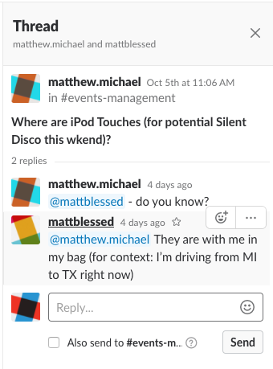

= Slack Information Guide
Slack is a Threaded messages channel. We use this to optimize communication all within a dedicated server, We can link other internl disscusions as well as outside sources. 
Now for slack a Key idea of this is one header/disscusions topic with a decent amount of context and threads underlying the main topic.

= The Concepts
* Channels
** Channels are where we store all these "topics" or Threads
*** Channels bring searchability to your conversations 
* Threads
** Within a Channel we have one or more Threads
*** Under that Thread we have a Reply section under a Thread
**** Within the Reply section we Link other conversations and Webpages to specify where we are getting our information from.

= Channels:
For the channels in slack you wont need to worry about creating a Channel, Those will already be made for you.
Channels help with sorting out data and orginizing your thoughts.

====
image::Channel_looks_like.jpeg[Screenshot]
====

= Threads 
So Threads are within our channel. Threads are our subtopics of the channels main topic. 
Threads are where we want one subidea to be expanded upon and all stay within the peramiters of the subtopics

====

====
So what you are looking at is a Thread within Slack.
Slack threads show you your Channel identified by the _in #events-managment_.
when you decide to reply within a thread make sure to _@SomeonesName_. So the person to which you are responding to a thread they will recieve a notification.
Now note that you may React/Emote to someones reply within a thread via the Smiley face with the (+) addition button. 

When replying in a thread, please be sure to clear, descriptive, and to the point. Tag whomever you need to so they recieve the notification and can get back to you at a later time.
If someone is saying the same question over and over and you feel like they are being obnoxious, its not the case. We ask the same question over and over cause there is some sort of information we are not getting or there is a thought that we don't understand.

    “No matter how many plans you make or how much in control you are, life is always winging it.” 
― Carroll Bryant